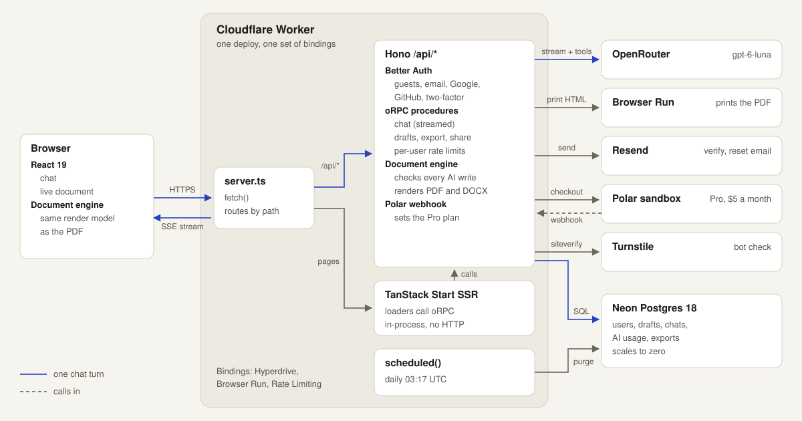

# Parley

**Describe the deal. Get the agreement.** Parley is an AI drafting tool for the 11 standard business agreements from [Common Paper](https://commonpaper.com/standards/): Mutual NDA, Cloud Service Agreement, DPA, SLA and more. You tell it about the deal in plain words, it picks the right agreement, asks only what it still needs, and fills the document live next to the chat. Then you download a PDF or a Word file.

**Live:** [parley.runtimedrift.dev](https://parley.runtimedrift.dev). No sign-up needed to start.

> Parley is a portfolio project, not a legal service. Its documents are not legal advice and are not for real agreements. The agreements are Common Paper's standards, used under [CC BY 4.0](templates/LICENSE.txt).

## How it works

1. **You describe the deal.** "We're about to show our roadmap to a possible manufacturing partner." Guests can start right away: a Turnstile check, then an anonymous account ([ADR-0011](docs/adr/0011-guests-are-anonymous-better-auth-users.md)).
2. **The AI picks the agreement and fills what it can.** The model (`gpt-6-luna` through OpenRouter) works through tools: `chooseDocument`, `updateFields`, `askQuestions`, `markComplete`. It never writes the document's text. Each change is a typed field value that the document engine checks before it is saved ([ADR-0003](docs/adr/0003-document-engine.md)). A value the engine refuses goes back to the model with the reason.
3. **It asks only for what's missing,** as a short questionnaire with likely answers to pick from, not a wall of chat.
4. **The document fills in live.** Each change shows in the chat with Undo, and the field lights up on the page. You can also edit any field yourself.
5. **Sign up to keep it.** The draft and the chat move to your new account ([ADR-0011](docs/adr/0011-guests-are-anonymous-better-auth-users.md)). Then download a PDF (printed by Browser Run, [ADR-0010](docs/adr/0010-pdf-through-browser-run-docx-in-the-worker.md)) or a Word file, or share a read-only link ([ADR-0007](docs/adr/0007-share-links.md)).

Free accounts get 3 documents a month. Pro ($5 a month, Polar sandbox, [ADR-0008](docs/adr/0008-pro-plan-through-polar.md)) has no limit and adds Word files.

## Architecture

<picture>
  <source media="(prefers-color-scheme: dark)" srcset="docs/architecture-dark.svg">
  
</picture>

- **One Worker** serves the pages, the API and the cron job: one deploy, one set of bindings, one Preview per branch ([ADR-0002](docs/adr/0002-one-worker-with-a-custom-entry.md)).
- **One document engine** (`packages/documents`) parses Common Paper's Markdown into typed fields and one render model. The live preview, the PDF and the Word file all come from it, so what you check on screen is what you download ([ADR-0003](docs/adr/0003-document-engine.md)).
- **The chat is a stream of typed parts** over oRPC: text, tool calls, questionnaires. The model's history comes from the database, never from the client.
- **Costs have four limits**: request size, per-user rate limits, daily messages per user, and a hard cap on the OpenRouter key ([ADR-0012](docs/adr/0012-cost-limits-in-four-layers.md)). The only fixed cost is the $5 Workers Paid plan. Neon scales to zero.
- **Logs and AI metrics** are structured events in Workers Observability, with no tokens or emails in them ([ADR-0005](docs/adr/0005-logs-and-metrics-in-workers-observability.md)).

## Quality

### AI evals

`pnpm evals` runs 36 scripted conversations through the real chat procedure, tools, engine and database, with a simulated user answering from each case's facts. Latest run, 2026-10-01 ([full report](evals/report.md)):

| Measure                   | Result      | Bar     |
| ------------------------- | ----------- | ------- |
| Right agreement           | 100%        | ≥ 90%   |
| Right field values        | 100%        | ≥ 95%   |
| Invalid writes            | 0           | 0       |
| Drafts finished           | 100%        | 100%    |
| **Cost per finished NDA** | **$0.0033** | < $0.02 |

The most expensive agreement, the Cloud Service Agreement, costs $0.014 per finished draft.

### Tests

| Layer                               | Runs in                                                                         | Tests            |
| ----------------------------------- | ------------------------------------------------------------------------------- | ---------------- |
| Document engine                     | Node                                                                            | 373              |
| App and server logic                | Node                                                                            | 298              |
| Database queries and migrations     | Real Postgres 18 ([ADR-0004](docs/adr/0004-real-postgres-for-tests-and-dev.md)) | 134              |
| Components                          | Vitest browser mode, Chromium                                                   | 157              |
| Worker: auth matrix, limits, routes | workerd, the real runtime                                                       | 448              |
| End to end                          | Playwright, 6 browser projects                                                  | 84               |
| AI evals                            | The real model                                                                  | 36 conversations |

`pnpm test` also runs type-level tests (`*.test-d.ts`): 1,306 tests in all, green on 2026-10-01. The auth matrix calls every procedure as no one, a guest, another user, the owner and a Pro user, and checks each gets exactly what it should.

Every outside service is also tested for real, in its sandbox (`pnpm test:real`, and the Real services CI job): a real model conversation from an NDA to its PDF, Browser Run, Polar sandbox checkout and webhooks, Resend delivery and Turnstile. Mutation testing scored 89% on the documents and quota code and 96% on auth.

### CI

- **Workers Builds**: every branch gets a Preview with its own Neon branch ([ADR-0009](docs/adr/0009-real-services-in-ci.md)). `main` deploys to production after the full gate.
- **GitHub Actions**: e2e against each Preview ([ADR-0001](docs/adr/0001-browser-tests-on-github-actions.md)); nightly runs with the e2e suite in all 6 browser projects (Chromium, Firefox and WebKit, desktop and phone), the evals, all 12 documents printed for real, Lighthouse, and an emailed report with the day's AI cost; a smoke test on production after each deploy.

## Run it locally

You need Node 24 and pnpm (`corepack enable`).

```sh
git clone https://github.com/VaelorAshbound/parley.git && cd parley
pnpm install
pnpm dev
```

Open [localhost:3000](http://localhost:3000). The first `pnpm dev` writes `apps/web/.dev.vars` from [the example](apps/web/.dev.vars.example) and starts a local Postgres 18 from npm, so there's no Docker and no account to make ([ADR-0004](docs/adr/0004-real-postgres-for-tests-and-dev.md)).

With no keys, the chat uses the scripted AI of the e2e tests, which fills a Mutual NDA from canned replies. To use the real model, add an `OPENROUTER_API_KEY` to `apps/web/.dev.vars`. For PDF export, run `pnpm exec wrangler login`. Every other key in the file is optional, and the file says what each one turns on.

## Commands

| Command             | What it does                                 |
| ------------------- | -------------------------------------------- |
| `pnpm dev`          | The app and a local Postgres                 |
| `pnpm check`        | Format, lint and type-check                  |
| `pnpm test`         | Unit, component and database tests           |
| `pnpm test:workers` | Worker tests in workerd, the real runtime    |
| `pnpm test:e2e`     | Playwright, locally or against `PREVIEW_URL` |
| `pnpm test:real`    | The real-service suite (costs a little)      |
| `pnpm evals`        | The AI evals with the real model             |
| `pnpm db:generate`  | A migration from schema changes              |

## Decisions

| ADR                                                                 | Decision                                                                 |
| ------------------------------------------------------------------- | ------------------------------------------------------------------------ |
| [0001](docs/adr/0001-browser-tests-on-github-actions.md)            | Browser tests on GitHub Actions, everything else on Workers Builds       |
| [0002](docs/adr/0002-one-worker-with-a-custom-entry.md)             | One Worker with a custom entry that sends `/api/*` to Hono               |
| [0003](docs/adr/0003-document-engine.md)                            | A pure document engine: parsed templates, typed fields, one render model |
| [0004](docs/adr/0004-real-postgres-for-tests-and-dev.md)            | Real Postgres for tests and local dev, from npm                          |
| [0005](docs/adr/0005-logs-and-metrics-in-workers-observability.md)  | Logs and AI metrics as structured events in Workers Observability        |
| [0006](docs/adr/0006-export-quota-counted-in-its-own-table.md)      | The export quota counts rows in its own table, under a per-user lock     |
| [0007](docs/adr/0007-share-links.md)                                | Share links are bearer tokens with one live link per draft               |
| [0008](docs/adr/0008-pro-plan-through-polar.md)                     | Parley Pro through Polar, read from Polar's current state                |
| [0009](docs/adr/0009-real-services-in-ci.md)                        | Real services in CI: a Neon branch per Preview                           |
| [0010](docs/adr/0010-pdf-through-browser-run-docx-in-the-worker.md) | PDF through Browser Run, Word files built in the Worker                  |
| [0011](docs/adr/0011-guests-are-anonymous-better-auth-users.md)     | Guests are anonymous Better Auth users, linked on sign-in                |
| [0012](docs/adr/0012-cost-limits-in-four-layers.md)                 | Cost limits in four layers, with a hard cap on the OpenRouter key last   |

## Stack

TypeScript · React 19 with the React Compiler · TanStack Start, Router, Query and Form · Tailwind CSS and shadcn/ui · Motion · Hono and oRPC on Cloudflare Workers · Vercel AI SDK and OpenRouter · Neon Postgres, Drizzle and Hyperdrive · Better Auth · Browser Run · Resend · Polar · Turnstile · Vite+ (Vitest, oxlint, oxfmt) · Playwright · pnpm workspaces.

Recovery: Neon's instant restore can branch the database from any point in its restore window.
